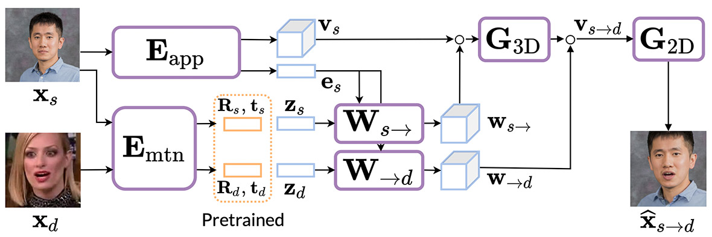

# MegaPortrait - SamsungLabs AI - Russia 
Implementation of Megaportrait using Claude Opus

All models / code is in model.py

(beware when working with claude if you paste copyright code - it will spit the dummy.)

when I was working with Claude - it suggested to implement the code for GazeLoss
this could be the actual code
https://github.com/SamsungLabs/rome/blob/2ee06861f018f2ab3c0f28cb40b4633bf2e6d657/src/losses/gaze.py#L16
